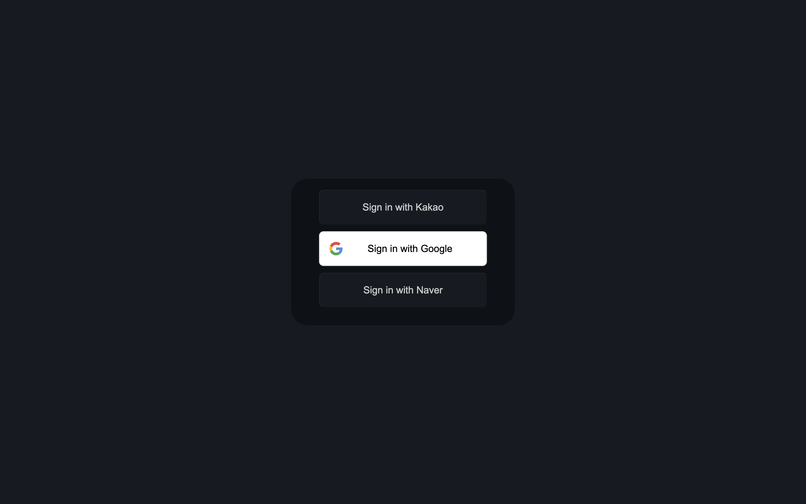
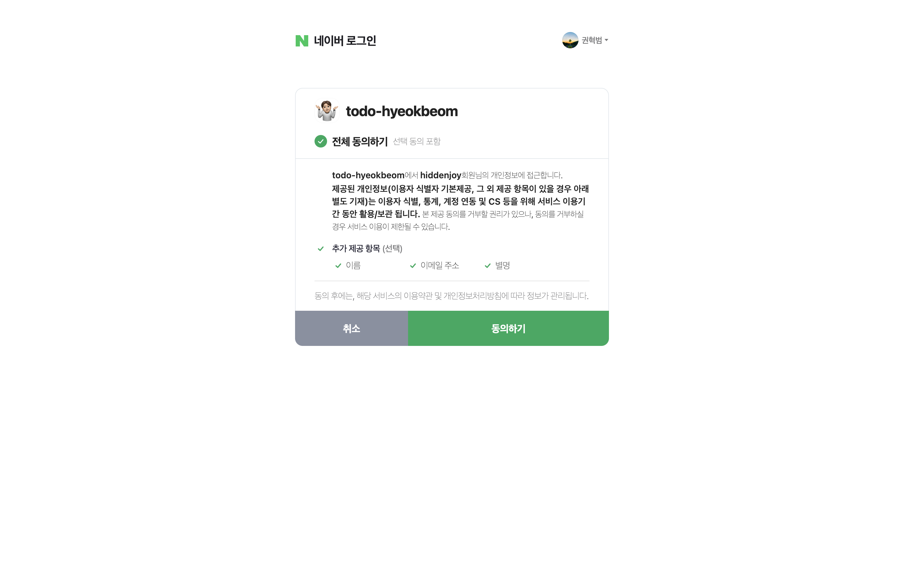
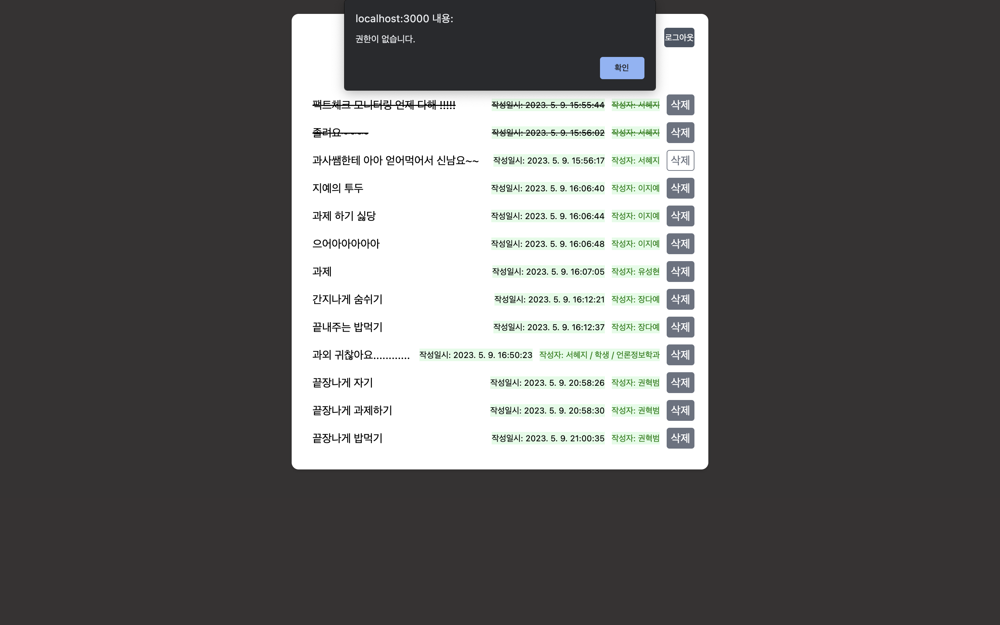

# Todo React App

## 9주차 issue (로그인 기능 추가)

### 언론정보학과 권혁범

---

1.  카카오톡  및 구글 및 네이버 로그인 구현
   - 로그인 버튼들: 
   - 네이버 로그인 화면: 
2. "권혁범" 카카오 계정으로 로그인하였을 때만, '관리자 페이지로 가기'라는 버튼이 노출됨.
   - "권혁범"으로 로그인한 경우: 
   - 다른 계정으로 로그인한 경우:
     
3. 관리자 화면은 초록색으로 디자인하였으며 다른 사람들의 투두를 삭제할 수 있는 권한만 부여함. (추가 및 토글 기능 삭제)
   - 관리자 화면: 
4. 다른 계정으로 로그인 한 이후, /admin 을 추가하여 관리자 페이지로 접근하게 되면, "관리자만 접근할 수 있습니다" 라는 alert가 발생하고 이전 화면으로 돌아가도록 구현함.
   - alert 화면: 
5. 권한 구현을 위해, delete와 toggle 기능에 userId를 확인하는 로직을 넣고, 삭제나 토글을 시도하면 "권한이 없습니다" alert를 발생하게 함.
   - alert 화면 (관리자는 원래 삭제가 모두 가능해야하겠지만, 권한 사용을 보여주기 위해 admin도 본인 투두에 대해서만 권한이 있는 것으로 설계함.): 
